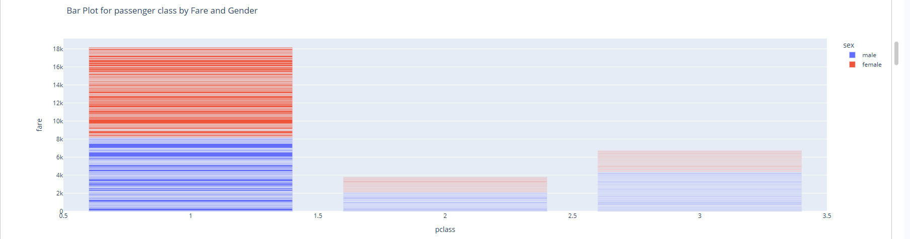
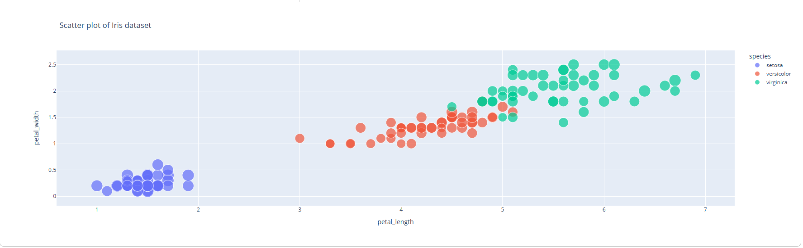
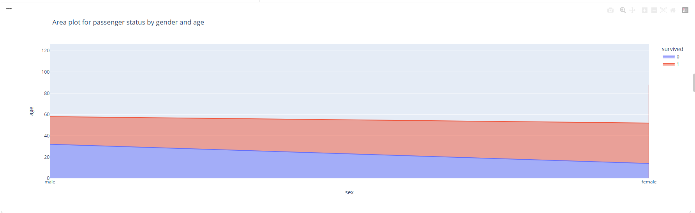
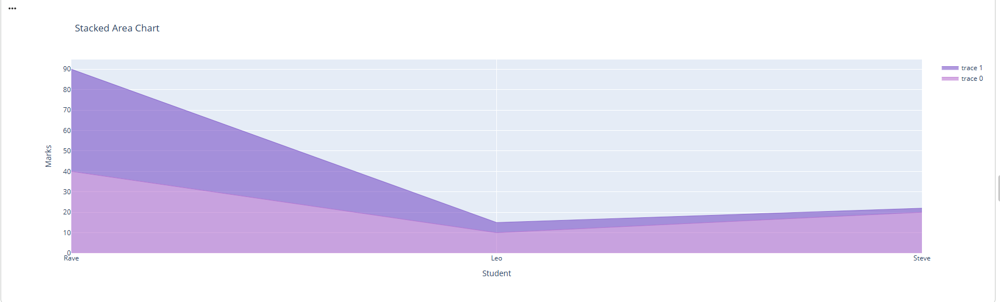

# data-visualization-using-plotly
Interactive Data Visualization using Plotly (Line, 3D, Sunburst, Area Charts)

## Project Overview
This project demonstrates interactive data visualization using Plotly in Python.
Various chart types were implemented including 2D, 3D, and hierarchical charts.

## Visualizations Implemented
- Line Charts
- Scatter Plots
- Stacked Area Charts
- Sunburst (Multilevel Pie Chart)
- 3D Graphs

## Technologies Used
- Python
- Plotly
- Pandas
- NumPy

## File Included
- Data_Visualisation_Using_Plotly.ipynb

## 🎯 Key Learning
Learned how to create interactive and visually appealing dashboards using Plotly.

##  Sample Visualizations
### 📈 Line Chart

### 📊 Bar Chart

### 📉 Scatter Plot

### 🥧 Pie Chart

### 🌞 Multilevel Pie Chart (Sunburst)

### 📊 Area Plot

### 📊 Stacked Area Chart

### 📈 Multiline Plot

